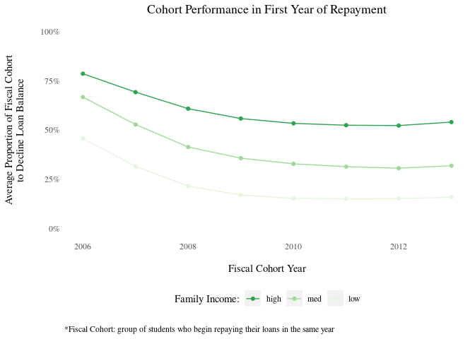
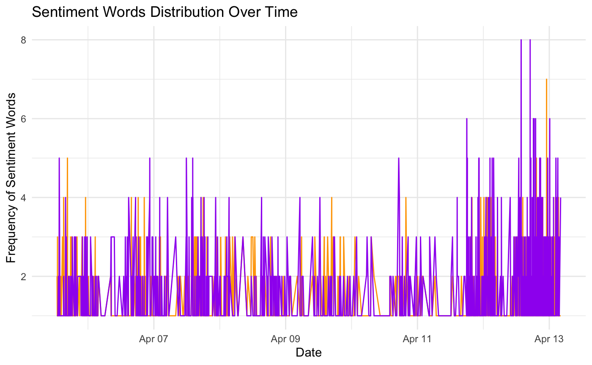

```{r setup, include=FALSE}
knitr::opts_chunk$set(echo = TRUE)
```

```{r packages, results="hide"}
r = getOption("repos")
r["CRAN"] = "http://cran.us.r-project.org"
options(repos = r)
# install.packages (basic)
suppressMessages(library(dplyr))
suppressMessages(library(tidyverse))

# install.packages (reading)
suppressMessages(library(XML))
suppressMessages(library(RCurl))
suppressMessages(library(readr))
suppressMessages(library("readxl"))

# install.packages (themes)
suppressMessages(library(ggthemes))
suppressMessages(library(ggrepel))
suppressMessages(library(RColorBrewer))
suppressMessages(library(viridis))
suppressMessages(library(hrbrthemes))
suppressMessages(library(plotly))


# install.packages (maps)
suppressMessages(library(RgoogleMaps))
suppressMessages(library(ggmap))
suppressMessages(install.packages("maps"))
suppressMessages(install.packages("tmap")) # install the CRAN version
suppressMessages(library(tmap))
suppressMessages(install.packages('rgeos'))

suppressMessages(library(devtools))
# Let's install the development version from Github. Run
devtools::install_github("rstudio/leaflet")
```
## Introduction & Motivation
At the end of this March, President Biden announced the cancellation of 1.3 billion dollar of student loans, accompanying with a clearer picture of his overall plan on student loan. While he canceled in total of 2.3 billion dollar of student loans for more than 110,000 student loan borrowers and received much appraise from the group, the reaction among all the Americans on this controversial issue has been quiet different. Therefore, in this project, our team want to investigate further on why student loan becomes a serious problem here in US, as well as how people in US has reacted to the issue based on their talk on social media platform. 

As discussed in other sections of our repository, this project sought to explore a factors related to socioeconomic conditions, student debt, inequities, and policy. This was a really broad topic so we did a decent amount of exploration of the data prior to deciding on a more specific topic. We tried to focus on specific aspects of the student loan issue including university selectivity, family income, repayment rate over time, and the regional difference of debt amount to understand why student debt becomes a more and more serious problem that people in US now are highly concern with. After understanding the issue and recognizing the problem, we then use the information from Google trend and Twitter platform to see how people reacted and talked about it.

## The Data 
### College Scorecard 
We worked with the 2019 College Scorecard (and with the 2010-2019 College Scorecard) to look at some trends that we thought would be interesting. The following is the dataset and some basic columns added to it for our analysis work. One way we did this was through attaining and concatenating the College Scorecard data as directly downloaded from the NCES. Below are the columns we selected for this: 

```{r csv load, results="hide"}
# Set the WD as Group_G_HigherEd 
setwd("~/Dropbox (Business)/Spring 2021/QMSS 5063 - Data Visualization /Group_G_HigherEd")

# While our initial College Scorecard only included 2019 initially, I was able to run a simple python script to concatenate and select a small number of relevant columns for our visualization and analysis. Thus, as our first visualizations only unclude 2019, the code below is for re-filtering the concatenated 2010-2019 data back into simply 2019. 

sc_time <- read_csv('src/2010_2019_student_debt.csv') 
sc <- sc_time %>% filter(Year_Ending == 2019)

# Renaming Latitude and Longitude Columns for later use 
sc <- sc %>% dplyr::rename(lat = LATITUDE) %>% dplyr::rename(long = LONGITUDE) %>% dplyr::rename(state = STABBR)

#recoding for admissions rates (ADM_RATE) to note selectivity level of schools
sc <- sc %>% dplyr::mutate(uni_rank = ifelse(ADM_RATE<0.05,'elite',ifelse(ADM_RATE<0.2,'highly selective', ifelse(ADM_RATE<0.3, 'selective',ifelse(ADM_RATE<0.7,'less selective', 'not selective')))))
colnames(sc)
# Selectivity Categories were made guided by as-yet unpublished work from Conwell et al. (2022 exp.) [1] as well as by articles from the US News and Rankings 
sc <- sc %>%
  dplyr::mutate(uni_rank = case_when(
    ADM_RATE < 0.05 ~ 'elite',
    ADM_RATE < 0.2 ~ 'highly selective',
    ADM_RATE < 0.3 ~ 'more selective',
    ADM_RATE < 0.5 ~ 'selective',
    ADM_RATE < 0.7 ~ 'less selective',
    TRUE ~ 'not selective')) %>% mutate(uni_rank = factor(uni_rank, levels=c('not selective', 'less selective', 'selective', 'more selective', 'highly selective', 'elite')))
```

#### Selected Columns (Described in College Scorecard)  

| variable                 | description                                               |
| :----------------------- | --------------------------------------------------------- |
| UNITID                   | IPEDS Unit ID                                             |   
| INSTNM                   | Institution Name                                          |
| CITY                     | description                                               |
| state                    | state                                                     |
| ZIP                      | Zip Code                                                  |
| DEBT_MDN                 | The median original amount of the loan principal upon entering repayment|
| UGDS                     | Number 
| ADM_RATE                 | Admission Rate                                            | 
| CONTROL                  | Private / Public Nonprofit (1 and 2) vs. For-Profit (3) Schools|
| MN_EARN_WNE_P10          | Min Earning after 10 Years (not used due to incomplete data) |
| MD_EARN_WNE_P10          | Med Earning after 10 Years (not used due to incomplete data) |
| UGDS_WHITE; UGDS_BLACK; UGDS_HISP; UGD.S_ASIAN | Proportion of Undergrads (White, Black, Hispanic, Asian)| 
| UGDS                     | Number of Undergrads                                      | 
| School                   | Same as INSTNM (disregard - used to filter out community colleges) | 
| ADM_RATE_ALL_1           | Admission Rate by OPE ID (not used in the end)            | 
| Year, Year_Starting, Year_Ending | Year Starting (twice due to how the data was read in) and Year Ending period covered by the scorecard | 

```{r initial map matching, echo = TRUE, eval = TRUE, warning = FALSE, message = FALSE}
us <- map_data("state")
us_states <- as_data_frame(us) %>% dplyr::rename(state=region)

mapping=aes(x = lat, y = long)
ggplot(us,  aes(x = long, y = lat, group=group)) +
  geom_polygon(aes(), color='white') + 
  theme_ipsum() + theme(panel.grid = element_blank())+ geom_point(data = sc, aes(x = long, y = lat, group=UNITID),color='gold',alpha=0.5)

```
  
  This dataset came with lat and lon columns, which made it somewhat easier to plot the universities without needing to Geocode their locations. 

  We also looked at data using the R package developed by the Urban Institute; specifically, we examined factors such as repayment rates. 

### Google Trend
The CSV file contains two columns. the first column shows the monthly date from 2004-01 to 2021-04 and the second column shows the number of searches on "student loan forgiveness" on Google in that month. We hope to observe changes in the number of monthly searches over time.  


### Twitter Dataset  

  When we were further along in our data visualization strategy, we also used the Twitter API to attain Tweet data about student debt, searching for key hashtags involving student debt, including #cancelstudentloandeby, #helpmiddleclassamericans, #zeropercentintereststudentloans as well as mentions of the terms 'borrower defense' and 'loan forgiveness'. The size of the Tweet data comes down to 2.4MB.  In the preprocessing steps, we selected only the following columns for analysis: "user","text","display_text_width", "hashtags","location". We want to use the text column to calculate the sentiment score for each tweet and the average sentiment score for each state. The text width column helps us to find out which state is most concerned about canceling student debt. Since our primary focus for the Twitter data set is to draw patterns of these tweets with geographical information and Twitter doesn’t provide sufficient geographical information for each tweet, we relied heavily on the users’ location information. This process involves getting rid of all the NA values and using google API to geocode users’ locations to longitude and latitude. Then, we reverse geocoded the data to get state and county data. 
  
## Projects 

As discussed in the introductory section, we had far too many subtopics within our dataset and we wanted to better explore a specific sub-topic prior to planning our visualizations. Thus, we began with trying to identify patterns within our dataset and other related datasets. 

We started by testing whether or not we would be able to generate a graph of where universities in the US are located. This was mostly to validate that the lat and lon columns were working properly and were not going to cause issues if we were to plot these institutions on a map. 

We then started trying to look at some trends that could be compiled into our visualization project. Some themes we were interested in were *race*, *socioeconomic status*, *student debt*, and *economic outcomes*.  

## Visuals Development Process 
This section of our notebook focuses on the information we have chosen to present for our visualizations and how we arrived at our current iterations. 

### Student Debt And School Selectivity

Because our project focuses on student debt and socioeconomic status and economic outcomes, one of the first things we looked at focused on student debt for different levels of selective-ness for universities in 2019. Our preliminary graph was strictly exploratory - we categorized schools from the College Scorecard by admissions rate (filtering specifically for 2019), splitting into the following categories:  
  
  - Elite (<5% admissions rate)  
  - Highly Selective (5-20% admissions rate)  
  - More Selective (20%-30% admissions rate)  
  - Selective (30-50% admissions rate)  
  - Less Selective (70%+ admissions rate)  
  
These categories were then plotted to show median student debt of each institution. 
```{r competitiveness_student_debt, echo=TRUE,eval=TRUE, message=FALSE,warning=FALSE}
sc_sub <- sc %>% subset(DEBT_MDN != 'PrivacySuppressed') %>% drop_na(uni_rank) %>% drop_na(DEBT_MDN)
sc_sub$uni_rank_cat = factor(sc_sub$uni_rank, levels=c('elite','highly selective','selective','less selective','not selective'))

ggplot(sc_sub, aes(x=uni_rank_cat,y=DEBT_MDN)) +
  geom_point(color = '#87495F',alpha=.12) +
  theme_ipsum(base_size = 12, axis_title_size = 14) +
  theme(
    panel.grid.major = element_blank(),
    panel.grid.minor = element_blank()) +
      ggtitle("Student Debt and School Tiers") +    
  labs(fill = "Selectivity", y="Student Debt", x = "School Competitiveness")

```
  
This was not a very good visual:  
  
  1. The transparency was used to visualize distribution (if there are more schools, the 'debt' point is darker) but does this poorly  
  2. The y-axis label was ugly, showing a number of grey points and it was unclear as to why this was happening.  
  
Despite these large issues, it did indicate that elite schools and highly selective schools appear to  exhibit lower levels of student debt on average. This was an interesting finding, and related to socioeconomic background vs because more selective schools are associated with higher outcomes after school and also often admitted a portion of legacy students and financially well-off students, who were able to receive tutoring for school and to devote time to activities (e.g., sports and leadership positions) that would allow them to more competitively gain entry into such schools.  
  
Thus, based on this preliminary visual, we made a number of adjustments:  
  
  1. We widened the pool, combining 'elite' and 'highly selective' schools, because the 'elite' category did not have very many schools (5) (and of the elite schools, only Stanford and Harvard were captured within this bucket; however, there were several smaller schools of nursing that happened to have very low acceptance rates). This regrouping was also done to reduce the number of 'selectivity' categories for simpler visualization. 
  2. To make it easier to understand, we set the color palette by attaining discrete colors from  a continuous ColorBrewer scale (BnBuPu) scale - as the school acceptance rate increases, the color gets closer to light purple (from green for 'elite/highly selective schools).  
  3. Finally, to show the trend even more clearly, we presented our findings as a scattergram, with the admissions rate on the x axis and the median debt on the y axis, and added a geom_smooth line. 

We also considered showing the distribution as a box / violin plot (see below), however, we concluded that it did not provide enough additional information and did not show the trends we are trying to highlight as clearly as I intended (namely, that elite and highly selective schools generally exhibited lower levels of median student debt). 

```{r warning=F, message=F}
#setwd("~/Dropbox (Business)/Spring 2021/QMSS 5063 - Data Visualization /Group_G_HigherEd/ideas_drafts/Process Book")
knitr::include_graphics("Images/Violin_Connie.png")
```

### Student Repayment Rates

In order to understand whether or not students are having more trouble with their increasing debts, we wanted to visualize repayment rates over time.  The data for this was very complicated: 


| variable                | description |
|:----------------------- | ----------- |
| unitid | unique school identifier |
| cohort_year | a group of students in a school who began repaying their loans in the same year |
| years_since_entering_repayment | the year of observation of the cohort since their first year |
| repay_rate | the proportion of students to make progress on their loans |
| repay_rate_<low/high/mid>income | same as repay rate, but the denominator is the fraction of students in various income brackets |
| repay_count | the number of students to make progress their loans (the numerator of repay_rate) |
| repay_count_<low/high/mid>income | number of students to make progress on their loans by income bracket |  

This means that each university has multiple observations for each cohort_year (on each year of their repayment), and the same information as divided by income bracket.  And, this information was presented as either the numerator or the proportion of the all students to enter the repayment phase of their student loans.  
  
Therefore, we wanted to visualize the variation in proportion of students to make progress on their loans over time.  And so, we took the median repayment rate for each cohort year in their first year of repayment and made the below plot:  
```{r warning=F, message=F}
knitr::include_graphics("../../src/visuals/repay_rate_files/figure-html/repay_rate_ave_draft-1.png")
```
But, in order to control for variation in the number of students across schools, I remade the plot by

1. finding the denominator (total number of students in a cohort by income bracket)
2. grouping the data by cohort year and income level
3. summing the numerator (count of students who made progress on their loans) and
4. summing the denominator (total students who made progress on their loans)
5. calculating the rate by dividing the numerator and denminator for each cohort year in each income range

In addition to modifying the calculations, I made some changes in the visual representation:

1. different color palette that better indicates ordinal categorical scale for income
2. transformed y proportion to percentages
3. expanded y axis to be 0 to 100%
4. added notation to explain a fiscal cohort.

These changes yielded the below plot:
```{r warning=F, message=F}

```

### Twitter Sentiment Across States

  The Google trend website gives us data about the time and the count of the total number of searches on Google. Plotting the total number of searches over time helps us to see changes in people's interest in student loan forgiveness. The pattern clearly shows that people's interest in this topic has spiked in 2021. We hypothesized that this is a result of the Biden administration's recent announcement of a reinterpretation of a federal student loan cancellation program which will result in $1 billion in student loan forgiveness. Ever since this announcement, more people have been pushing for a more progressive policy and asking President Biden to cancel student debt through executive action. However, there is still a lot of uncertainties around whether a universal student loan forgiveness will be initiated via executive order or legislation. 
  
```{r warning=F, message=F}
knitr::include_graphics("Image/Twitter_Trend.png")
```
  
  When looking at the extracted words and associated sentiments, we looked first at some of the most frequent words (and their cntribution to the seniment score of the tweet itself): 
```{r warning=F, message=F}
knitr::include_graphics("Images/Tweets_Student_Debt_Ariel.png")
```
  
  We decided that the above bar graph could be better expressed differently (either through a map or through a wordcloud) and tried to do this instead.  

```{r warning=F, message=F}
knitr::include_graphics("Images/WordCloud_Ariel.png")
```
  
  Our first wordcloud included the primary words in he hashtag and some frequent words that we did not feel added enough meaning (we are already aware given the selected hashtags that the topic would be student debt for example). We modified our wordcloud by removing these terms. 

  The modified wordcloud map shows key words that appeared in the tweets data. The size of the word represents how frequent it appears in tweets. Some of the most noticeable ones include people, president, loans, job, college, pay, biden, education, studentloanforgiveness, etc.

```{r warning=F, message=F}
knitr::include_graphics("Image/WordCloud.png")
```

Below is the initial choropleth map we wanted to put in our project. It shows the distribution of average sentiment score in each state. The popup window shows the state, the associated average sentiment score, the total word counts, and the top tweets keywords. Darker color means the state has a higher average sentiment score.  

```{r warning=F, message=F}
knitr::include_graphics("Image/choropleth_sentiment.png")
```
  
  We scrapped these in part because the Chloropleth itself (with statewide sentiment score) was once again not very informative as it does not end up adding to our story even about how people generally are feeling. We don't have enough information from this map about how people are feeling in different parts of the country, and it's harder to conceptualize or understand the sentiment score itself (for the viewer) in a salient way. 
  
### Appendix: Trends Explored and Scrapped

#### Student Debt and Racial Composition 
```{r debt_race, echo=TRUE,eval=TRUE, message=FALSE,warning=FALSE}
#dfsub %>% group_by(uni_rank) mutate(density = n()) 

m <- ggplot(sc_sub, aes(x=DEBT_MDN,y=UGDS_BLACK, color = uni_rank_cat)) +
  geom_point(aes(color = uni_rank_cat), alpha=.4) +
  geom_smooth(se=FALSE) +
  scale_color_manual(values=c("navy","lightblue","aquamarine3","orange","gold"))+
  geom_smooth(method = lm, se = FALSE)+
  theme_ipsum() +
  theme(
    panel.grid.major = element_blank(),
    panel.grid.minor = element_blank()) +
      ggtitle("Student Debt and Racial Composition (Black Students)") +    
  labs(y="% Black Students", x = "Median Student Debt ($)")
m
```
  
  We also looked at debt and racial breakdown. As shown here, we did not identify a very clear trend - as such, we left 'race and student debt' alone for the time being as we were attempting to work on scaling down to more specific topics.  
  
#### Positive and Negative Words Over Time 

  Finally, we tried to take our tweet data and look at the frequency of the positive and negative words over time. After looking at this information, we noted that it did not add anything to our current information (as again sentiment scores can be abstract, and there were no trends based on sentiment identified); we chose not to include or develop these further.
  
```{r warning=F, message=F}

knitr::include_graphics("Images/Positive_Words_Ariel.png")
knitr::include_graphics("Images/Negative_Words_Ariel.png")
```

## General Decisions  
  We tried to follow the principles we learned in class throughout our work. Specifically, we tried to show data comparatively, 

### Challenges  
  Some challenges we encountered included:  
  - We ha

---  
[1] - Conwell, Jordan A. and Natasha Quadlin. Forthcoming. “Race, Gender,Higher Education, and Socioeconomic Attainment: Evidence from Baby Boomers at Mid-Life.” Social Forces. DOI: 10.1093/sf/soab010.

