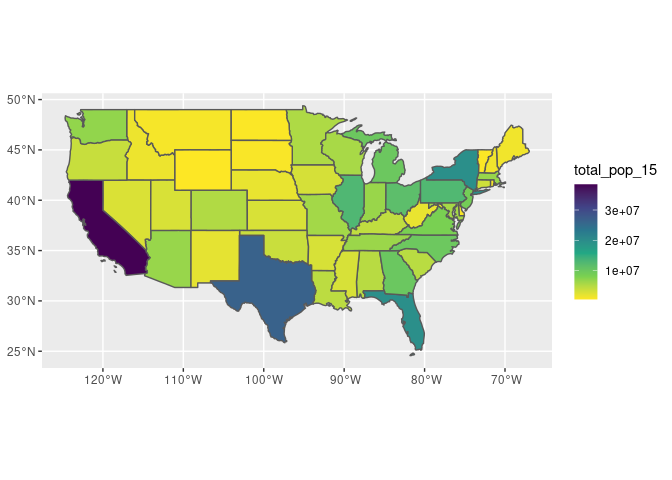
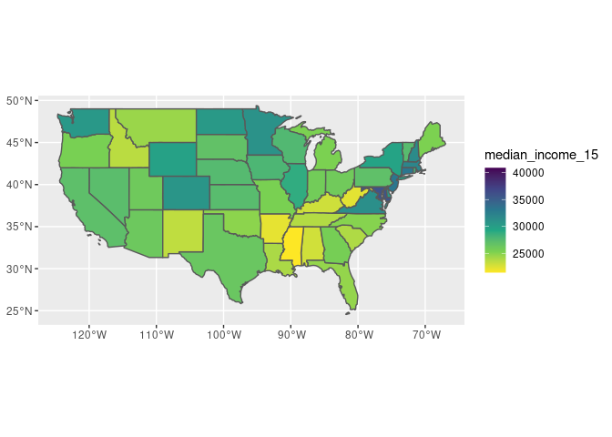
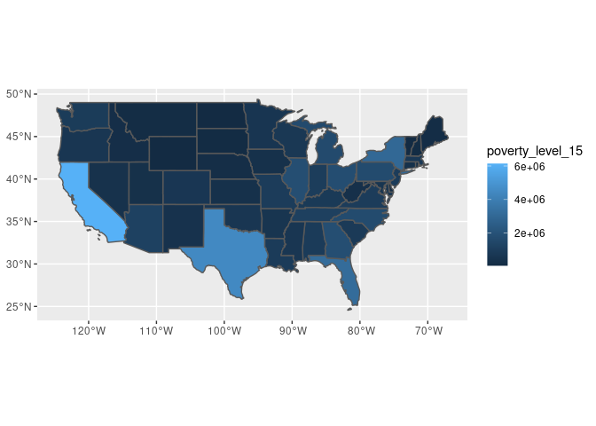

```r
rm(list=ls())
knitr::opts_chunk$set(echo = TRUE)

# Load packages.
packages <- c("devtools","knitr","tidyverse","ggthemes", "ggmap", "educationdata",
              "spData")

packages <- lapply(packages, FUN = function(x) {
  if(!require(x, character.only = TRUE)) {
    install.packages(x)
  library(x, character.only = TRUE)
  }
}
)
library(educationdata)
library(spData)
library(urbnmapr)
library(readxl)
library(httr)

# https://github.com/UrbanInstitute/education-data-package-r
```


```
## 
## Attaching package: 'DT'
```

```
## The following objects are masked from 'package:shiny':
## 
##     dataTableOutput, renderDataTable
```

```
## 
## Attaching package: 'crosstalk'
```

```
## The following object is masked from 'package:shiny':
## 
##     getDefaultReactiveDomain
```

```
## Linking to GEOS 3.8.0, GDAL 3.0.4, PROJ 6.3.1
```

# Data

## educationdata


```r
# educationdata ipeds outcome measures
filepath <- "../data/educationdata/ipedsOutcomes2017.csv"
## if file exists, don't make it again cuz it takes a real long time
if(file.exists(filepath)) {
  ipeds17 <- read_csv(filepath)
} else {
  ipeds17 <- get_education_data(level = 'college-university', source = 'ipeds', 
                                topic = 'outcome-measures', filters = list(year = 2017),
                                add_labels = TRUE)
  write.csv(ipeds17, filepath, row.names = FALSE)
}
ipeds17
```

```
## # A tibble: 92,368 x 38
##     year unitid ftpt      fips    cohort_rev_6yr exclusions_6yr cohort_adj_6yr
##    <dbl>  <dbl> <chr>     <chr>   <lgl>          <lgl>          <lgl>         
##  1  2017 100654 Part-time Alabama NA             NA             NA            
##  2  2017 100654 Full-time Alabama NA             NA             NA            
##  3  2017 100654 Full-time Alabama NA             NA             NA            
##  4  2017 100654 Part-time Alabama NA             NA             NA            
##  5  2017 100654 Full-time Alabama NA             NA             NA            
##  6  2017 100654 Total     Alabama NA             NA             NA            
##  7  2017 100654 Part-time Alabama NA             NA             NA            
##  8  2017 100654 Total     Alabama NA             NA             NA            
##  9  2017 100654 Part-time Alabama NA             NA             NA            
## 10  2017 100654 Full-time Alabama NA             NA             NA            
## # … with 92,358 more rows, and 31 more variables: completers_6yr <dbl>,
## #   completion_rate_6yr <dbl>, exclusions_add_8yr <lgl>, cohort_adj_8yr <lgl>,
## #   completers_8yr <dbl>, still_enroll_8yr <dbl>, transfer_8yr <dbl>,
## #   unknown_8yr <dbl>, no_award_8yr <dbl>, completion_rate_8yr <dbl>,
## #   still_enroll_transfer_rate_8yr <dbl>, still_enroll_rate_8yr <dbl>,
## #   transfer_rate_8yr <dbl>, class_level <chr>, cohort_year <dbl>,
## #   fed_aid_type <chr>, cohort_rev <dbl>, exclusions <dbl>, cohort_adj <dbl>,
## #   award_cert_4yr <dbl>, award_assoc_4yr <dbl>, award_bach_4yr <dbl>,
## #   completers_4yr <dbl>, completion_rate_4yr <dbl>, award_cert_6yr <dbl>,
## #   award_assoc_6yr <dbl>, award_bach_6yr <dbl>, award_cert_8yr <dbl>,
## #   award_assoc_8yr <dbl>, award_bach_8yr <dbl>, unknown_rate_8yr <dbl>
```

## state and county geospatial and metadata
Some metadata from usda: https://www.ers.usda.gov/data-products/county-level-data-sets/download-data/


```r
# us_states from spData
## updated as of 2015 or something
data("us_states")
data(us_states_df) # has poverty measures and things
head(us_states)
```

```
## Simple feature collection with 6 features and 6 fields
## Geometry type: MULTIPOLYGON
## Dimension:     XY
## Bounding box:  xmin: -114.8136 ymin: 24.55868 xmax: -71.78699 ymax: 42.04964
## Geodetic CRS:  NAD83
##   GEOID        NAME   REGION             AREA total_pop_10 total_pop_15
## 1    01     Alabama    South 133709.27 [km^2]      4712651      4830620
## 2    04     Arizona     West 295281.25 [km^2]      6246816      6641928
## 3    08    Colorado     West 269573.06 [km^2]      4887061      5278906
## 4    09 Connecticut Norteast  12976.59 [km^2]      3545837      3593222
## 5    12     Florida    South 151052.01 [km^2]     18511620     19645772
## 6    13     Georgia    South 152725.21 [km^2]      9468815     10006693
##                         geometry
## 1 MULTIPOLYGON (((-88.20006 3...
## 2 MULTIPOLYGON (((-114.7196 3...
## 3 MULTIPOLYGON (((-109.0501 4...
## 4 MULTIPOLYGON (((-73.48731 4...
## 5 MULTIPOLYGON (((-81.81169 2...
## 6 MULTIPOLYGON (((-85.60516 3...
```

```r
head(us_states_df)
```

```
## # A tibble: 6 x 5
##   state      median_income_10 median_income_15 poverty_level_10 poverty_level_15
##   <chr>                 <dbl>            <dbl>            <dbl>            <dbl>
## 1 Alabama               21746            22890           786544           887260
## 2 Alaska                29509            31455            64245            72957
## 3 Arizona               26412            26156           933113          1180690
## 4 Arkansas              20881            22205           502684           553644
## 5 California            27207            27035          4919945          6135142
## 6 Colorado              29365            30752           584184           653969
```

```r
# us_counties from urbnmapr
us_counties <- get_urbn_map("counties", sf = TRUE)

# scorecard data
sc <- read_csv('../src/data/2019_College_Scorecard_Valid_Admissions_Data.csv')
```

```
## Warning: Missing column names filled in: 'X1' [1]
```

```
## 
## ── Column specification ────────────────────────────────────────────────────────
## cols(
##   .default = col_logical(),
##   X1 = col_double(),
##   UNITID = col_double(),
##   OPEID = col_double(),
##   OPEID6 = col_double(),
##   INSTNM = col_character(),
##   CITY = col_character(),
##   STABBR = col_character(),
##   ZIP = col_character(),
##   ACCREDAGENCY = col_character(),
##   INSTURL = col_character(),
##   NPCURL = col_character(),
##   HCM2 = col_double(),
##   MAIN = col_double(),
##   NUMBRANCH = col_double(),
##   PREDDEG = col_double(),
##   HIGHDEG = col_double(),
##   CONTROL = col_double(),
##   ST_FIPS = col_double(),
##   REGION = col_double(),
##   LOCALE = col_double()
##   # ... with 937 more columns
## )
## ℹ Use `spec()` for the full column specifications.
```

```
## Warning: 44 parsing failures.
##  row                     col expected            actual                                                           file
## 1626 OMENRYP_ALL_POOLED_SUPP a double PrivacySuppressed '../src/data/2019_College_Scorecard_Valid_Admissions_Data.csv'
## 1626 OMENRAP_ALL_POOLED_SUPP a double PrivacySuppressed '../src/data/2019_College_Scorecard_Valid_Admissions_Data.csv'
## 1626 OMAWDP8_ALL_POOLED_SUPP a double PrivacySuppressed '../src/data/2019_College_Scorecard_Valid_Admissions_Data.csv'
## 1626 OMENRUP_ALL_POOLED_SUPP a double PrivacySuppressed '../src/data/2019_College_Scorecard_Valid_Admissions_Data.csv'
## 1759 OMENRYP_ALL_POOLED_SUPP a double PrivacySuppressed '../src/data/2019_College_Scorecard_Valid_Admissions_Data.csv'
## .... ....................... ........ ................. ..............................................................
## See problems(...) for more details.
```

```r
sc
```

```
## # A tibble: 1,933 x 2,392
##       X1 UNITID  OPEID OPEID6 INSTNM   CITY   STABBR ZIP   ACCREDAGENCY  INSTURL
##    <dbl>  <dbl>  <dbl>  <dbl> <chr>    <chr>  <chr>  <chr> <chr>         <chr>  
##  1     0 100654 100200   1002 Alabama… Normal AL     35762 Southern Ass… www.aa…
##  2     1 100663 105200   1052 Univers… Birmi… AL     3529… Southern Ass… https:…
##  3     3 100706 105500   1055 Univers… Hunts… AL     35899 Southern Ass… www.ua…
##  4     4 100724 100500   1005 Alabama… Montg… AL     3610… Southern Ass… www.al…
##  5     5 100751 105100   1051 The Uni… Tusca… AL     3548… Southern Ass… www.ua…
##  6     7 100830 831000   8310 Auburn … Montg… AL     3611… Southern Ass… www.au…
##  7     8 100858 100900   1009 Auburn … Auburn AL     36849 Southern Ass… www.au…
##  8     9 100937 101200   1012 Birming… Birmi… AL     35254 Southern Ass… www.bs…
##  9    10 101189 100300   1003 Faulkne… Montg… AL     3610… Southern Ass… www.fa…
## 10    13 101365 962107   9621 Herzing… Birmi… AL     35209 Higher Learn… https:…
## # … with 1,923 more rows, and 2,382 more variables: NPCURL <chr>,
## #   SCH_DEG <lgl>, HCM2 <dbl>, MAIN <dbl>, NUMBRANCH <dbl>, PREDDEG <dbl>,
## #   HIGHDEG <dbl>, CONTROL <dbl>, ST_FIPS <dbl>, REGION <dbl>, LOCALE <dbl>,
## #   LOCALE2 <lgl>, LATITUDE <dbl>, LONGITUDE <dbl>, CCBASIC <dbl>,
## #   CCUGPROF <dbl>, CCSIZSET <dbl>, HBCU <dbl>, PBI <dbl>, ANNHI <dbl>,
## #   TRIBAL <dbl>, AANAPII <dbl>, HSI <dbl>, NANTI <dbl>, MENONLY <dbl>,
## #   WOMENONLY <dbl>, RELAFFIL <dbl>, ADM_RATE <dbl>, ADM_RATE_ALL <dbl>,
## #   SATVR25 <dbl>, SATVR75 <dbl>, SATMT25 <dbl>, SATMT75 <dbl>, SATWR25 <lgl>,
## #   SATWR75 <lgl>, SATVRMID <dbl>, SATMTMID <dbl>, SATWRMID <lgl>,
## #   ACTCM25 <dbl>, ACTCM75 <dbl>, ACTEN25 <dbl>, ACTEN75 <dbl>, ACTMT25 <dbl>,
## #   ACTMT75 <dbl>, ACTWR25 <lgl>, ACTWR75 <lgl>, ACTCMMID <dbl>,
## #   ACTENMID <dbl>, ACTMTMID <dbl>, ACTWRMID <lgl>, SAT_AVG <dbl>,
## #   SAT_AVG_ALL <dbl>, PCIP01 <dbl>, PCIP03 <dbl>, PCIP04 <dbl>, PCIP05 <dbl>,
## #   PCIP09 <dbl>, PCIP10 <dbl>, PCIP11 <dbl>, PCIP12 <dbl>, PCIP13 <dbl>,
## #   PCIP14 <dbl>, PCIP15 <dbl>, PCIP16 <dbl>, PCIP19 <dbl>, PCIP22 <dbl>,
## #   PCIP23 <dbl>, PCIP24 <dbl>, PCIP25 <dbl>, PCIP26 <dbl>, PCIP27 <dbl>,
## #   PCIP29 <dbl>, PCIP30 <dbl>, PCIP31 <dbl>, PCIP38 <dbl>, PCIP39 <dbl>,
## #   PCIP40 <dbl>, PCIP41 <dbl>, PCIP42 <dbl>, PCIP43 <dbl>, PCIP44 <dbl>,
## #   PCIP45 <dbl>, PCIP46 <dbl>, PCIP47 <dbl>, PCIP48 <dbl>, PCIP49 <dbl>,
## #   PCIP50 <dbl>, PCIP51 <dbl>, PCIP52 <dbl>, PCIP54 <dbl>, CIP01CERT1 <dbl>,
## #   CIP01CERT2 <dbl>, CIP01ASSOC <dbl>, CIP01CERT4 <dbl>, CIP01BACHL <dbl>,
## #   CIP03CERT1 <dbl>, CIP03CERT2 <dbl>, CIP03ASSOC <dbl>, CIP03CERT4 <dbl>,
## #   CIP03BACHL <dbl>, …
```

```r
# county level poverty data
#usda_pov_19 <- read_xls("../data/usda/PovertyEstimates.xls", skip = 4)
#usda_pov_19

#usda
## https://www.ers.usda.gov/data-products/county-level-data-sets/download-data/
### poverty by county level
url <- "https://www.ers.usda.gov/webdocs/DataFiles/48747/PovertyEstimates.xls?v=9293.8"
GET(url, write_disk(tf <- tempfile(fileext = ".xls")))
```

```
## Response [https://www.ers.usda.gov/webdocs/DataFiles/48747/PovertyEstimates.xls?v=9293.8]
##   Date: 2021-04-12 19:19
##   Status: 200
##   Content-Type: application/vnd.ms-excel
##   Size: 1 MB
## <ON DISK>  /tmp/Rtmph4NkYC/file31c5489fa2dd.xls
```

```r
usda_pv <- read_xls(tf, sheet = 1, skip = 4)
usda_pv
```

```
## # A tibble: 3,193 x 34
##    FIPStxt Stabr Area_name  `Rural-urban_Con… Urban_Influence… `Rural-urban_Con…
##    <chr>   <chr> <chr>                  <dbl>            <dbl>             <dbl>
##  1 00000   US    United St…                NA               NA                NA
##  2 01000   AL    Alabama                   NA               NA                NA
##  3 01001   AL    Autauga C…                 2                2                 2
##  4 01003   AL    Baldwin C…                 4                5                 3
##  5 01005   AL    Barbour C…                 6                6                 6
##  6 01007   AL    Bibb Coun…                 1                1                 1
##  7 01009   AL    Blount Co…                 1                1                 1
##  8 01011   AL    Bullock C…                 6                6                 6
##  9 01013   AL    Butler Co…                 6                6                 6
## 10 01015   AL    Calhoun C…                 3                2                 3
## # … with 3,183 more rows, and 28 more variables:
## #   Urban_Influence_Code_2013 <dbl>, POVALL_2019 <dbl>, CI90LBALL_2019 <dbl>,
## #   CI90UBALL_2019 <dbl>, PCTPOVALL_2019 <dbl>, CI90LBALLP_2019 <dbl>,
## #   CI90UBALLP_2019 <dbl>, POV017_2019 <dbl>, CI90LB017_2019 <dbl>,
## #   CI90UB017_2019 <dbl>, PCTPOV017_2019 <dbl>, CI90LB017P_2019 <dbl>,
## #   CI90UB017P_2019 <dbl>, POV517_2019 <dbl>, CI90LB517_2019 <dbl>,
## #   CI90UB517_2019 <dbl>, PCTPOV517_2019 <dbl>, CI90LB517P_2019 <dbl>,
## #   CI90UB517P_2019 <dbl>, MEDHHINC_2019 <dbl>, CI90LBINC_2019 <dbl>,
## #   CI90UBINC_2019 <dbl>, POV04_2019 <dbl>, CI90LB04_2019 <dbl>,
## #   CI90UB04_2019 <dbl>, PCTPOV04_2019 <dbl>, CI90LB04P_2019 <dbl>,
## #   CI90UB04P_2019 <dbl>
```

# state maps


```r
## states by population
### question: should this be scaled by area?
us_states %>% ggplot() + geom_sf(aes(fill = total_pop_15)) +
  scale_fill_continuous(type = "viridis", direction = -1)
```

<!-- -->

```r
## states by median income in 2015
us_states %>% left_join(us_states_df, by = c("NAME" = "state")) %>%
  ggplot() + geom_sf(aes(fill = median_income_15)) +
  scale_fill_continuous(type = "viridis", direction = -1)
```

<!-- -->

```r
## states by median poverty level in 2015
### does this poverty level look quite right?
us_states %>% left_join(us_states_df, by = c("NAME" = "state")) %>%
  ggplot() + geom_sf(aes(fill = poverty_level_15))
```

<!-- -->

# county maps

```r
# prep data for plotting
## check shared names
mean(unique(usda_pv$Area_name) %in% unique(us_counties$county_name))
```

```
## [1] 0.9683446
```

```r
## change projection of sc data
sc_sf <- sc %>%
  dplyr::mutate(uni_rank = case_when(
    ADM_RATE < 0.05 ~ 'elite',
    ADM_RATE < 0.2 ~ 'highly selective',
    ADM_RATE < 0.3 ~ 'selective',
    ADM_RATE < 0.7 ~ 'less selective',
    TRUE ~ 'not selective')) %>% filter(uni_rank %in% c('elite', 'highly selective')) %>%
  select(uni_rank, LONGITUDE, LATITUDE) %>% na.omit() %>% sf::st_as_sf(coords = c("LONGITUDE", "LATITUDE"), crs = 4326)

# base plot
p <- us_counties %>% left_join(usda_pv, by = c("county_name" = "Area_name")) %>%
  ggplot() + scale_fill_continuous(type = "viridis", direction = -1) + ggthemes::theme_tufte()
## rural-urban continuum_code
p + geom_sf(aes(fill = `Rural-urban_Continuum_Code_2013`), lwd = 0) +
  geom_sf(data = us_states, color = "white", fill = NA, lwd = 0.4) +
  ggtitle("Rural-urban Continuum Code, 2013")
```

<!-- -->

```r
## poverty estimate of people of all ages living in poverty: PCTPOVALL_2019
### question: how change the legend to %?
### note: change colors so that they are easily visible
### note: look at other patterns?
p + geom_sf(aes(fill = PCTPOVALL_2019), lwd = 0) +
  geom_sf(data = us_states, color = "white", fill = NA, lwd = 0.4) +
  ggtitle("Estimated percent of people of all ages in poverty (2019)") +
  labs(fill = "Percent") + geom_sf(data = sc_sf, aes(shape = uni_rank), color = "purple", size = 1.5)
```

<!-- -->

# shiny attempt


```r
# User- Interface
# --------------- # 
ui <- fluidPage( 
  plotOutput("map"),
  plotOutput("graph"),
  mainPanel(selectInput("uni_rank", "echelon", c("highly selective", "elite")), # Here is where the users chooses the month. Note the tag: "month" 
  )
)

# Server
# ------ #

server <- function(input,output) {
  output$map <- renderPlot({ # Try renderLeaflet or renderTmap
  ggplot(merged) +
      geom_sf(aes(fill = PCTPOVALL_2019), lwd = 0) +
      geom_sf(data = us_states, color = "white", fill = NA, lwd = 0.4) +
      scale_fill_continuous(type = "viridis", direction = -1) +
      geom_sf(data = filter(sc_sf, uni_rank == input$uni_rank), aes(shape = input$uni_rank), color = "purple", size = 5)
  })
  
  output$graph <- renderPlot({
    ggplot(sc_sf, aes(x = uni_rank)) + geom_bar()
  })

}

# Run the APP. 
# ------------ # 
shinyApp(ui = ui, server = server)
```

```
## PhantomJS not found. You can install it with webshot::install_phantomjs(). If it is installed, please make sure the phantomjs executable can be found via the PATH variable.
```

`<div style="width: 100% ; height: 400px ; text-align: center; box-sizing: border-box; -moz-box-sizing: border-box; -webkit-box-sizing: border-box;" class="muted well">Shiny applications not supported in static R Markdown documents</div>`{=html}
