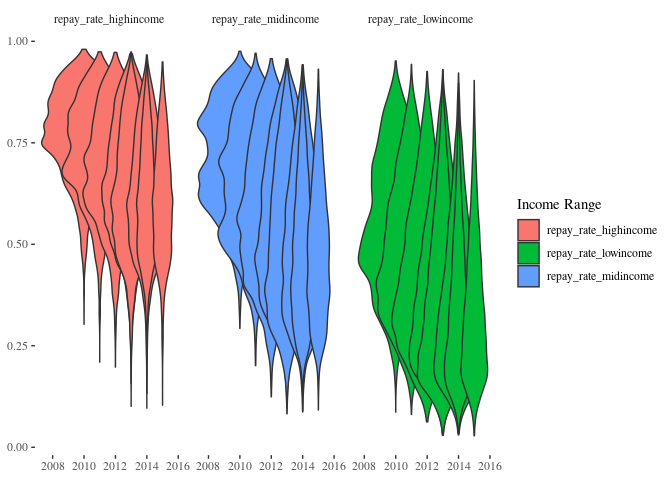

```r
library(ggplot2)
library(tidyverse)

filepath <- paste0(stringr::str_remove(getwd(),"visuals"), "data/sc_repay.Rdata")
if(file.exists(filepath)) {
  load("../data/sc_repay.Rdata")
} else {
  sc_repay <- educationdata::get_education_data(level = 'college-university', source = 'scorecard',
                                              topic = 'repayment', filters = list(year = 2007:2016),
                                              add_labels = TRUE)
  save(sc_repay, file = "../data/sc_repay.Rdata")
}

scorecard <- readr::read_csv("../data/2019_College_Scorecard_Valid_Admissions_Data.csv")
```


```r
#selective_schools <- na.omit(scorecard$OPEID[scorecard$ADM_RATE < 0.3])

sc_repay %>%
  pivot_longer(cols = c("repay_rate_lowincome", "repay_rate_midincome", "repay_rate_highincome"),
               names_to = "class", values_to = "rates") %>%
  filter(rates > 0) %>%
  ggplot(aes(x = year, y = rates, group = cohort_year, fill = class)) + geom_violin() +
  facet_wrap(. ~ factor(class, levels =
                          c("repay_rate_highincome", "repay_rate_midincome", "repay_rate_lowincome"))) +
  ggthemes::theme_tufte() +
  labs(fill = "Cohort Year")
```

<!-- -->

Note that the `echo = FALSE` parameter was added to the code chunk to prevent printing of the R code that generated the plot.
